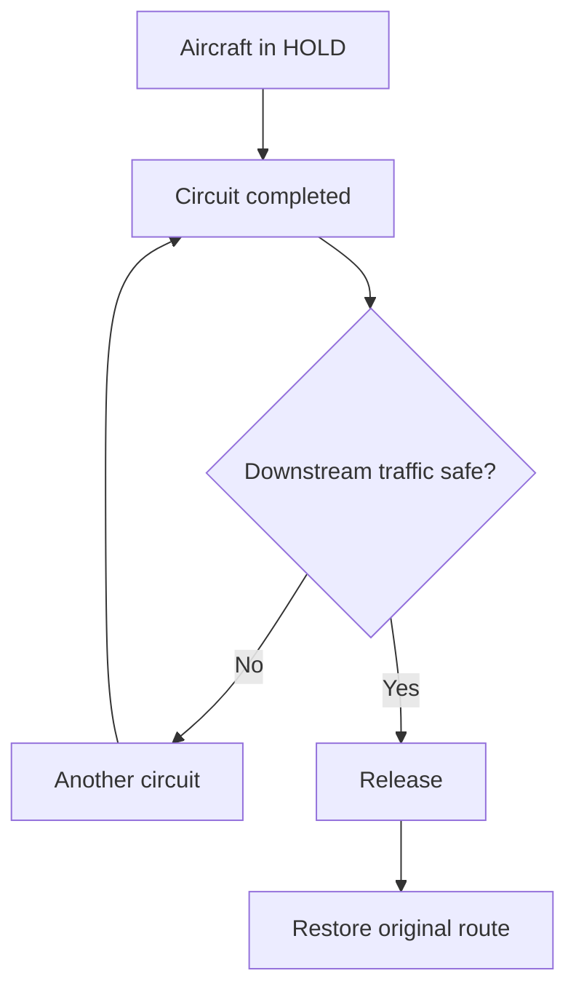
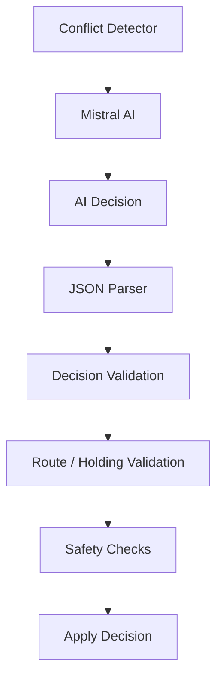
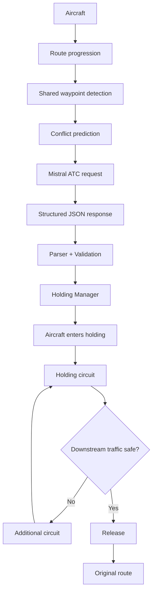
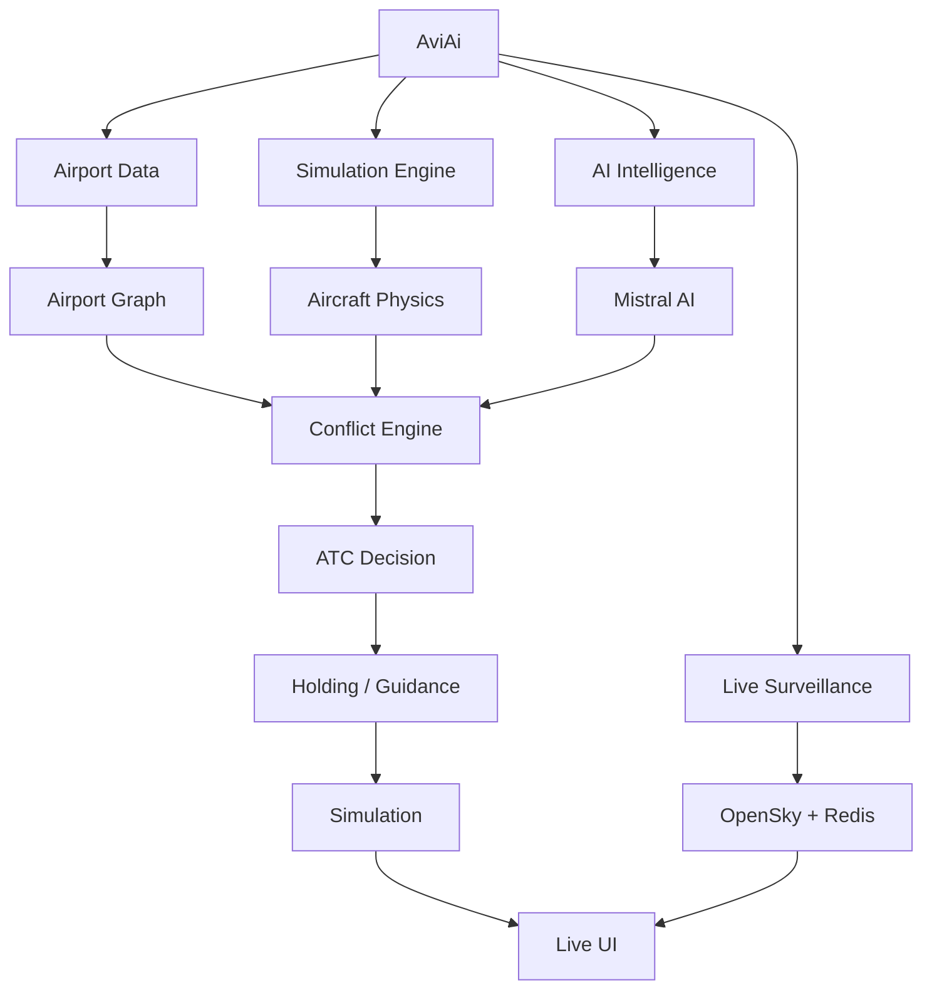

<div align="center">

# ✈️ AviAi

### Real-Time Aviation Intelligence & Autonomous AI ATC Simulation

*Live global aircraft surveillance, aviation chart intelligence, and an airport digital twin where AI makes the ATC decisions and deterministic logic keeps every decision safe.*


</div>

---

## 📑 Table of Contents

- [Overview](#-overview)
- [Features](#-features)
- [How It Works](#-how-it-works)
- [AI ATC (Mistral Integration)](#-ai-atc-mistral-integration)
- [Airport Digital Twin](#-airport-digital-twin)
- [Architecture](#-architecture)
- [Getting Started](#-getting-started)
- [Usage](#-usage)
- [Performance](#-performance)
- [Roadmap](#-roadmap)
- [Author](#-author)

---

## 📖 Overview

**AviAi** is an aviation intelligence platform with three connected layers:

1. **Live Surveillance:** ingests live global aircraft data from the OpenSky Network, analyzes trajectories and behavior, and visualizes traffic on an interactive flight-radar map.
2. **Chart Intelligence (experimental):** upload aviation charts (AIP / airport chart PDFs) and query them in natural language.
3. **Autonomous AI ATC Simulation:** an airport digital twin (VABB) where simulated traffic follows real procedures and an AI controller resolves conflicts using holding patterns, with every AI decision validated by deterministic safety logic.

Built on an asynchronous architecture (**FastAPI**, **Redis**, **WebSockets**, **Leaflet**), AviAi is not just about displaying aircraft on a map. It aims to simulate how an airport and its Air Traffic Control system actually operate.

```
Instead of:   Aircraft Tracker

AviAi becomes:   Airport Digital Twin
                      +
                 Aircraft Simulation
                      +
                 Autonomous ATC
                      +
                 Traffic Intelligence
                      +
                 Operational Decision System
```

---

## ✨ Features

### ✈️ Live Aircraft Surveillance

- 🌍 Real-time aircraft data from the OpenSky Network
- ⚡ Asynchronous ingestion pipeline (aiohttp)
- 📡 WebSocket-based live aircraft streaming
- 🚀 Redis-powered low-latency state caching
- 🗺️ Interactive flight-radar style map (Leaflet)
- 🛫 Heading-rotated aircraft icons
- 📈 Altitude-colored trajectory trails
- 🎯 Aircraft selection and highlighting
- 📊 Live tooltips (callsign, altitude, speed, heading)
- 🔄 Automatic WebSocket reconnection

### 🧠 Aircraft Intelligence Engine

Continuously analyzes aircraft movement and generates operational insights:

- 📈 Vertical trend detection (climb, cruise, descent)
- ✈️ Aircraft behavior classification
- 🚨 Flight event detection
- 🛣️ Route inference from live trajectories

### 📄 Chart Intelligence (Experimental)

Upload official aviation charts and interact with them using natural language.

**Current capabilities**

- 📤 Upload AIP and airport chart PDFs
- 📑 Multi-page text extraction
- 🔍 Semantic search over chart content
- 💾 Session-based document indexing
- 💬 Natural language question answering
- 📄 Source-grounded responses
- 🚫 Hallucination prevention using retrieved chart content

**Example queries**

- Which airport chart is this?
- What runways are available?
- What is the aerodrome elevation?
- What magnetic variation is published?
- What operational remarks apply?
- What are the runway dimensions?

**Current limitations**

- Instrument approach procedures are not decoded yet
- Frequency tables require structured extraction
- Visual chart highlighting is not yet supported
- Spatial geometry (runways, taxiways) is handled separately by the [Airport Chart Parser](#airport-chart-parser), which is still in development

### 🤖 Autonomous AI ATC Simulation

| Feature | Description |
|---|---|
| 🧠 **AI ATC** | Mistral AI makes ATC decisions only when a relevant conflict is detected |
| 🛬 **Deterministic Guidance** | Normal flight follows predefined routes, waypoints, altitude and speed constraints with no AI calls |
| 🔀 **Arrival Routes & Load Balancing** | Multiple VABB arrival routes with configured capacities |
| 🚦 **Traffic Generation** | Realistic arrival/departure traffic with callsigns, airlines, origins and aircraft types |
| 📏 **Spawn Separation** | Minimum 4.5 NM separation enforced when spawning aircraft |
| ⚠️ **Conflict Detection** | Detects aircraft predicted to reach the same waypoint at the same time |
| 🔁 **Dynamic Holding Patterns** | Racetrack holds with circuit tracking and safe release |
| 🛡️ **AI + Deterministic Safety** | Every AI decision is parsed and validated before it touches the simulation |
| 📜 **AI ATC Decision Log** | Structured, explainable log of every AI decision |
| 🗺️ **Live Simulation UI** | Real-time map streamed over WebSocket |

---

## 🧠 How It Works

### Live Surveillance Pipeline

```text
OpenSky Network API
          │
          ▼
Async Ingestion Engine (aiohttp)
          │
          ▼
Intelligence Engine (trend, behavior, events, routes)
          │
          ▼
Redis Aircraft State Store
          │
          ▼
FastAPI Backend
          │
          ▼
WebSocket Flight Stream
          │
          ▼
Leaflet Live Map
```

1. OpenSky provides live aircraft states.
2. The asynchronous ingestion engine continuously retrieves them.
3. States are enriched with vertical trend detection, behavior classification, event detection, and route inference.
4. Aircraft information is cached in Redis.
5. FastAPI broadcasts updates through WebSockets.
6. Leaflet renders positions and trajectories in real time.

### AI ATC Simulation: Hybrid Architecture

AviAi follows a **hybrid architecture**: AI handles decisions, deterministic systems handle everything else.

| 🤖 AI handles | ⚙️ Deterministic systems handle |
|---|---|
| Decision making | Aircraft physics |
| Conflict interpretation | Route navigation |
| ATC instruction generation | Waypoint progression |
| Holding selection | Safety validation |
| Operational reasoning | Route restoration |
| | Holding geometry & circuit tracking |
| | Spawn separation |
| | Simulation state |

This prevents the AI from having unrestricted control over the simulation.

#### 1. Deterministic Flight Guidance

Aircraft do not depend on AI for every movement. Normal flight follows the predefined route, applying assigned waypoints, route order, altitude constraints, speed constraints, and navigation targets automatically.


The AI is only triggered when a relevant conflict is detected.

#### 2. Arrival Routes


The current VABB simulation includes routes `001`, `002`, `003`, and `004`. Traffic is distributed using configured capacities, and the traffic manager selects eligible routes based on current load:

| Route | Capacity |
|:---:|:---:|
| 001 | 5 |
| 002 | 4 |
| 003 | 4 |
| 004 | 5 |

#### 3. Traffic Generation

Simulated traffic includes callsign, airline, origin, destination, aircraft type, flight phase, route, position, altitude, speed, and heading.

```
AIC100 | Air India | FRA → VABB
AIC101 | Air India | LHR → VABB
AIC102 | Air India | CDG → VABB
```

Traffic is intentionally increased to create realistic airport congestion.

#### 4. Minimum Spawn Separation

New aircraft cannot spawn too close to existing ones. The **4.5 NM** requirement is a *minimum*, not an exact distance.

| Distance | Result |
|:---:|:---:|
| 3.8 NM | ❌ Reject |
| 4.4 NM | ❌ Reject |
| 4.5 NM | ⚖️ Boundary |
| 5.0 NM | ✅ Allowed |
| 7.0 NM | ✅ Allowed |
| 10 NM | ✅ Allowed |

#### 5. Shared-Waypoint Conflict Detection

```
Aircraft A:  MB379 → EMROS → OLGUS
Aircraft B:  MB392 → EMROS → OLGUS
```

If both are predicted to reach **EMROS** at about the same time, a conflict is raised and passed to the AI ATC controller.

#### 6. AI-Triggered Holding

```
Conflict:  AIC100 ↔ BAW153
Waypoint:  EMROS
Decision:  HOLD BAW153
```

The selected aircraft is moved into the configured holding route, and **its original route is preserved**:

```
Original:    MB379 → EMROS → OLGUS
During hold: MB379 → EMROS → [HOLD loop] → EMROS → OLGUS
```

#### 7. Holding Pattern System

Holding patterns are racetrack-style loops defined in `holding_routes.json`, independent of the normal arrival routes. Each holding route contains the holding fix, entry point, loop waypoints and coordinates, rejoin waypoint, and route relationship. Holding nodes are activated dynamically and do not become permanent normal-route nodes.

Currently configured holding fixes include **EMROS** and **OLGUS**. POKON and KETOR are intentionally not configured as holding fixes.

#### 8. Holding Circuit Management

An aircraft is not necessarily released after one circuit. AviAi tracks the current circuit, circuit progress, circuit boundary, holding fix, original route, rejoin waypoint, and downstream traffic. At every circuit boundary it decides whether the aircraft can safely leave:



Release separation also considers aircraft altitude. After release, the aircraft rejoins its original route at the rejoin waypoint and the temporary holding route is removed from active navigation.

#### 9. AI + Deterministic Safety

AviAi never blindly executes an AI response. The AI proposes, the system validates:



Invalid AI output can never directly modify the simulation.

#### 10. Full Conflict Flow



---

## 🤖 AI ATC (Mistral Integration)

AviAi currently uses **`ministral-3b-2512`** exclusively for ATC decision generation. The AI receives:

- Aircraft callsign, flight phase, position, current waypoint
- Assigned route, altitude, speed, heading
- Nearby traffic and the conflict waypoint
- Available holding patterns and route constraints

It is instructed to return **structured JSON**, not natural language:

```json
{
  "controller": "Arrival",
  "decision": "HOLD",
  "callsign": "BAW153",
  "instruction": "Hold at EMROS via the standard holding pattern, maintain current altitude and speed.",
  "holding_route_id": "H-EMROS",
  "holding_fix": "EMROS",
  "altitude": 10000,
  "speed": 250,
  "reason": "Confirmed traffic conflict at EMROS; BAW153 is crossing the waypoint en route to OLGUS while AIC100 is also at EMROS. HOLD ensures separation."
}
```

### 📜 AI ATC Decision Log

Every decision is recorded in the simulation UI in a structured, human-readable form:

```
AI ATC [ARRIVAL]

Conflict:     AIC100 ↔ BAW153
Waypoint:     EMROS
Decision:     HOLD BAW153
Instruction:  Hold at EMROS via the standard holding pattern.
Holding:      H-EMROS
Altitude:     10000 ft
Reason:       Confirmed traffic conflict at EMROS.
```

The log shows what conflict occurred, which aircraft were involved, which was instructed, where, which holding pattern was selected, what altitude/speed was assigned, and **why**.

### 🖥️ Simulation UI

The simulation is visualized in `sim.html` and streamed through the simulation WebSocket. It shows aircraft with callsigns (e.g. `AIC100`, `BAW153`, `DLH149`), routes, waypoints, all configured holding fixes (even when nothing is holding), active holding tracks, AI ATC decisions, aircraft state, weather, and simulation status.

---

## 🏢 Airport Digital Twin

AviAi is built around airport-specific operational data. For **VABB**, this includes runways, taxiways, the airport graph, routes, waypoints, approach procedures, holding points, and airport coordinates. Airport reference data is also available through `airports.csv`.

### Airport Chart Parser

A geometry pipeline extracts airport structures from aviation charts:


It can identify runways, taxiways, lines, connected components, waypoints, and overall airport geometry.

### Real Aircraft Data

AviAi ingests live aircraft data through **OpenSky** and updates the intelligence layer. The project has previously handled thousands of aircraft updates from this source.

---

## 🏗️ Architecture



### Tech Stack

| Layer | Technology |
|---|---|
| **Frontend** | HTML5, CSS3, JavaScript, Leaflet.js, `sim.html` |
| **Backend** | Python, FastAPI, Uvicorn, aiohttp, WebSockets |
| **Data & Storage** | Redis, SQLite / PostgreSQL components, OpenSky Network API, Airports CSV |
| **Parsing** | PyMuPDF, NumPy |
| **AI & Intelligence** | Mistral AI (`ministral-3b-2512`), semantic retrieval, trajectory analysis, event detection, behavior classification, route inference |

### API Endpoints

| Endpoint | Purpose |
|---|---|
| `/health` | Health check |
| `/flights/ws` | Live OpenSky flight stream (WebSocket) |
| `/airport/VABB` | Airport data |
| `/airport/VABB/graph` | Airport graph |
| `/airport/VABB/routes` | Arrival/departure routes |
| `/airport/VABB/approach` | Approach procedures |
| `/weather/VABB` | Weather information |
| `/simulation/ws` | Live simulation WebSocket |

### Project Structure

```
AviAi/
│
├── app/
│   ├── api/
│   │   ├── flights.py
│   │   ├── ai.py
│   │   ├── charts.py
│   │   ├── simulation.py
│   │   └── semantics.py
│   │
│   ├── ingest/
│   │   ├── opensky_async.py
│   │   └── opensky_auth.py
│   │
│   ├── intelligence/
│   │   ├── trajectory.py
│   │   ├── behavior.py
│   │   ├── event_engine.py
│   │   ├── route_engine.py
│   │   ├── guidance_ai.py
│   │   └── mistral/
│   │       ├── client.py
│   │       ├── controller.py
│   │       ├── parser.py
│   │       └── prompt.py
│   │
│   ├── simulation/
│   │   ├── engine.py
│   │   ├── world.py
│   │   ├── traffic_manager.py
│   │   └── holding_manager.py
│   │
│   ├── parser/
│   │   ├── vector_extractor.py
│   │   ├── geometry_classifier.py
│   │   ├── geometry_cleaner.py
│   │   ├── neighbor_builder.py
│   │   └── component_builder.py
│   │
│   ├── navigation/routes/
│   │   └── vabb_routes.json
│   │
│   ├── core/
│   │   └── config.py
│   │
│   └── main.py
│
├── frontend/
│   ├── index.html
│   └── plane.svg
│
├── static/
│   ├── sim.html
│   └── charts.html
│
├── data/
│   └── airports.csv
│
├── holding_routes.json
├── requirements.txt
├── .env
├── .gitignore
└── README.md
```

---

## 🚀 Getting Started

### 1. Clone the repository

```bash
git clone https://github.com/SK25397938/AviAi.git
cd AviAi
```

### 2. Create a virtual environment

```bash
python -m venv venv
```

```bash
# Windows
venv\Scripts\activate

# Linux / macOS
source venv/bin/activate
```

### 3. Install dependencies

```bash
pip install -r requirements.txt
```

### 4. Configure environment variables

Create a `.env` file in the project root:

```env
# Live surveillance (OpenSky)
OPENSKY_CLIENT_ID=your_client_id
OPENSKY_CLIENT_SECRET=your_client_secret

# Redis
REDIS_HOST=localhost
REDIS_PORT=6379

# AI ATC (Mistral)
MISTRAL_API_KEY=your_mistral_api_key
```

Additional variables may be required depending on enabled services.

### 5. Start Redis

Run Redis locally or via Docker:

```bash
docker run -d -p 6379:6379 redis
```

### 6. Launch the application

```bash
python -m uvicorn app.main:app --reload
```

The server runs at `http://127.0.0.1:8000`.

### Test the Mistral connection

```bash
python -c "from app.intelligence.mistral.client import generate; print(generate('Reply with exactly: TEST'))"
```

A successful run returns a structured AI response.

---

## 🌐 Usage

| What | URL |
|---|---|
| ✈️ Live Flight Map | `http://127.0.0.1:8000/map/` |
| 🛬 AI ATC Simulation | `http://127.0.0.1:8000/map/sim.html` |
| ❤️ Health Check | `http://127.0.0.1:8000/health` |
| 📡 Flight Stream (WebSocket) | `ws://127.0.0.1:8000/flights/ws` |
| 🎮 Simulation Stream (WebSocket) | `ws://127.0.0.1:8000/simulation/ws` |

---

## 📊 Performance

- ⚡ ~0.5 second refresh interval
- 🌍 Supports thousands of simultaneous aircraft
- 🚀 Fully asynchronous ingestion
- 🎞️ Smooth rendering using `requestAnimationFrame`
- 🔄 Automatic WebSocket recovery

---

## 🗺️ Roadmap

### ✅ Current

- [x] Live OpenSky surveillance with Redis caching and WebSocket streaming
- [x] Trajectory, behavior, event, and route intelligence
- [x] Experimental chart question answering
- [x] Arrival traffic, route following, and traffic generation
- [x] Minimum spawn separation
- [x] Shared-waypoint conflict detection
- [x] AI ATC intervention with validated decisions
- [x] Holding patterns, circuit management, safe release, route restoration
- [x] AI decision logging and live simulation visualization

### 🔜 Next


- **Sequencing:** landing order, arrival spacing, holding requirements, speed adjustments, vectoring, merge management
- **Approach Control:** STAR → initial → intermediate → final approach → runway
- **Departure Control:** pushback → taxi → runway → takeoff → SID → en-route
- **Ground Control:** taxiway conflict detection, runway occupancy, pushback sequencing, ground routing, taxi clearance

### 💡 Planned Enhancements

- 📄 Advanced aviation chart parser (approach procedures, frequency tables, visual highlighting)
- 🛰️ Airport surface movement guidance
- 📈 Flight plan correlation
- ⚠️ Conflict detection and prediction on live traffic
- 📊 Aviation analytics dashboard
- 🛫 Airport arrival and departure prediction

---

## 🧭 Development Philosophy

1. **Realistic aviation behavior:** aircraft follow procedures and operational constraints, not just point-to-point movement.
2. **AI where decisions matter:** AI makes meaningful ATC decisions and is never called for deterministic navigation.
3. **Deterministic safety:** every AI decision is validated by deterministic logic before it affects an aircraft.

## 🔭 Vision

A fully autonomous airport operations simulation where aircraft arrive autonomously and follow real procedures, traffic changes continuously, conflicts are detected automatically, AI ATC sequences traffic, holding patterns are used dynamically, aircraft are released safely, departures interact with arrivals, and ground operations evolve in real time.

---

## 👤 Author

**Subodh Koli (Sk)**, B.Tech AI & Data Science, SIES Graduate School of Technology, Mumbai

[](https://github.com/SK25397938)
[](https://linkedin.com/in/subodh-koli-9266a237a/)

---

<div align="center">

**AviAi: Autonomous Aviation Intelligence**
*AI-driven airport operations and ATC simulation platform*

⭐ If you found this project useful, consider giving it a star on GitHub!

</div>
